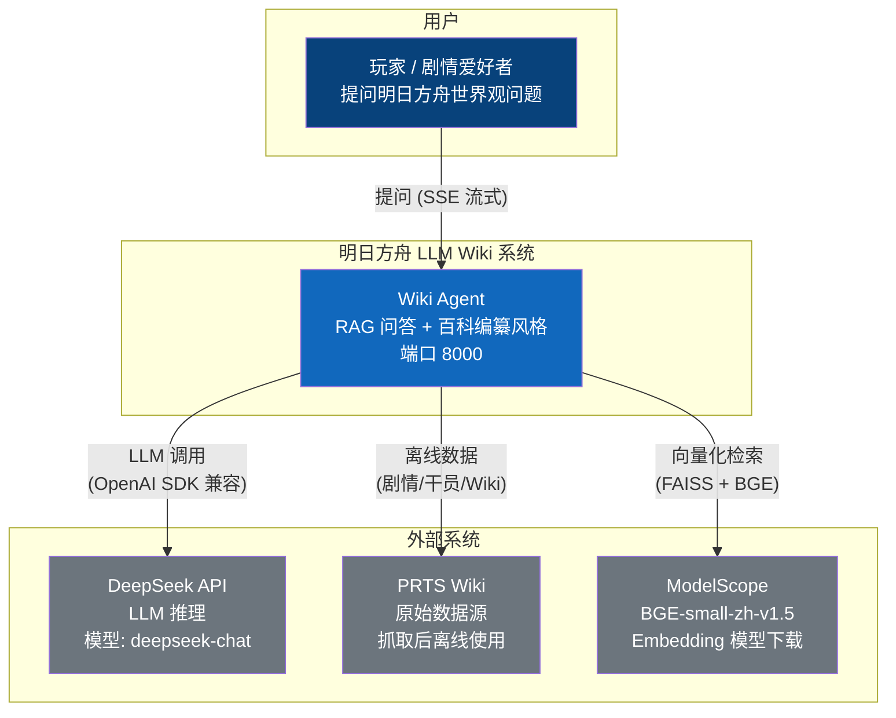
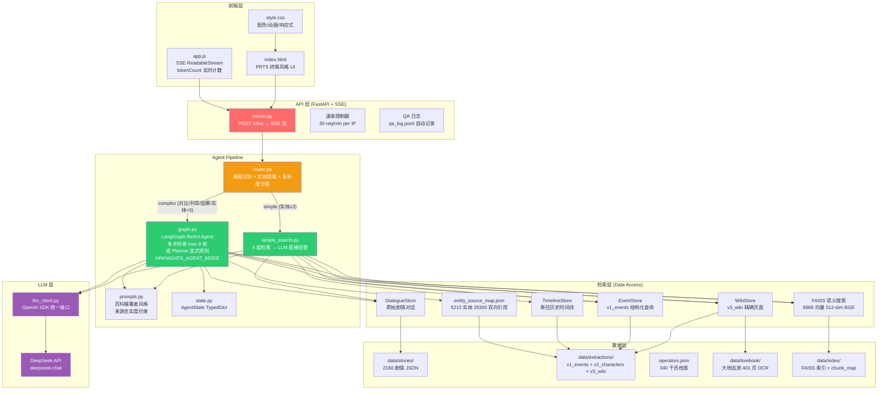
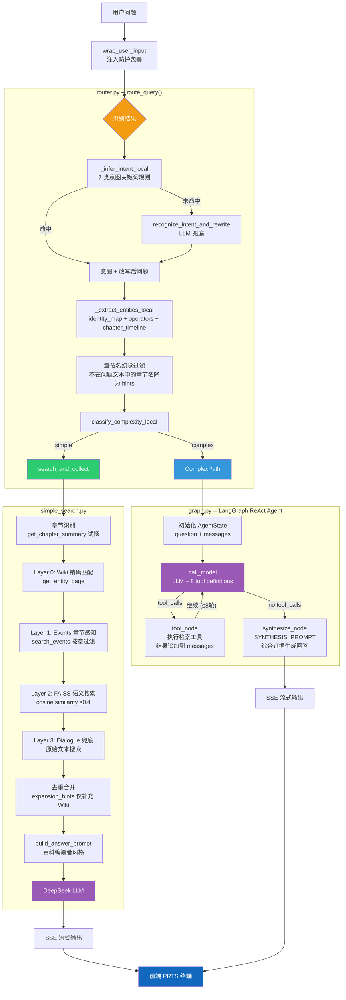
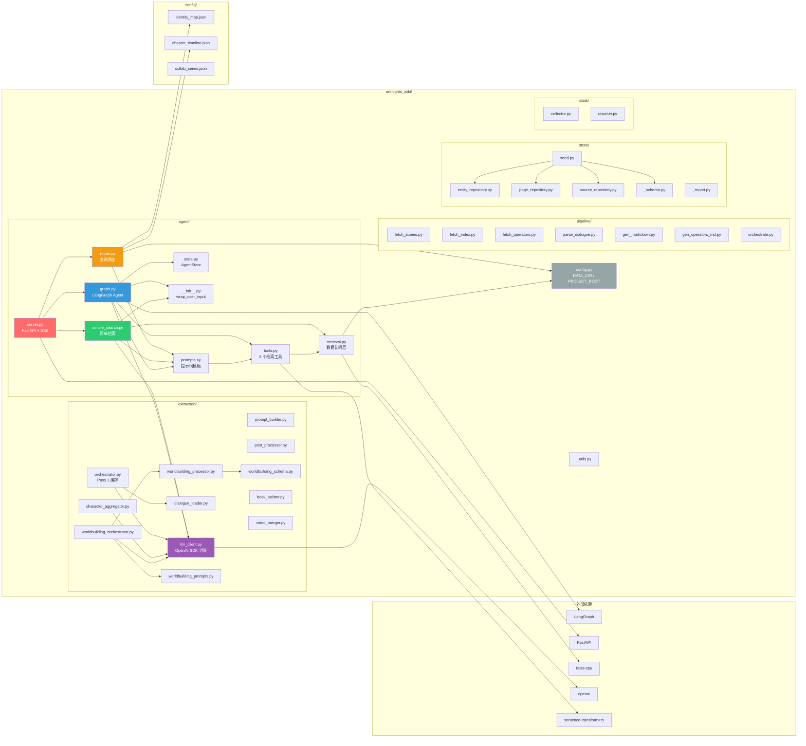

# 明日方舟 LLM Wiki -- 架构图

> 生成日期: 2026-07-04 | 工具: Mermaid

---

## 1. C4 Context -- 系统上下文图



**系统边界**: Wiki Agent 是一个独立的 RAG 问答系统，数据离线预处理，对外仅依赖 DeepSeek API 做推理。

---

## 2. System Architecture -- 系统架构图



**分层说明**:
- **前端层**: 纯 HTML/CSS/JS，PRTS 终端风格，双栏布局 (聊天 + 检索追踪)
- **API 层**: FastAPI + SSE 流式输出，内建速率限制和 QA 日志
- **Agent Pipeline**: 查询路由 + 双路径检索 (simple/complex)
- **检索层**: 6 种检索策略统一接口，惰性加载缓存
- **数据层**: 全离线数据 (剧情/提取/干员/设定集/向量索引)
- **LLM 层**: OpenAI SDK 统一接口，当前使用 DeepSeek

---

## 3. Agent Pipeline -- 数据流图



**关键设计决策**:
- **意图识别**: 本地规则优先 (7 类意图)，LLM 兜底 (无匹配时)
- **实体提取**: 3 层精确提取替代全量扫描 (噪声从 5-9 降至 1-2)
- **章节感知**: 自动识别章节名 → 事件搜索按章过滤
- **expansion_hints 分离**: 不参与路由决策和事件检索
- **LangGraph Agent**: ReAct 模式，最多 8 轮 tool 调用，无外部搜索依赖

---

## 4. Component Diagram -- 代码模块依赖图



**模块职责**:
| 模块 | 职责 | 核心依赖 |
|------|------|----------|
| `agent/` | RAG 问答服务 (API + 路由 + 检索 + LLM) | extraction/llm_client, LangGraph, FastAPI |
| `extraction/` | Pass 1/2/3 数据提取管线 | llm_client, OpenAI SDK |
| `pipeline/` | 原始数据抓取 + 解析 + Markdown 生成 | 无外部 |
| `store/` | SQLite 种子数据库 (实体/索引/页面) | sqlite3 |
| `stats/` | 提取过程统计 (耗时/token/费用) | sqlite3 |
| `config/` | 静态配置文件 | 无 |

---

## 5. 升级阶段架构（W1–W4，2026-08）

> 生成日期: 2026-08-19 | 工具: Mermaid | 规则: architecture-diagrams skill

### 5.1 运行链路与工程化能力

```mermaid
graph TB
    subgraph "运行链路（complex 路径）"
        SRV[server.py<br/>SSE + checkpoint 工厂] --> SEL{选择图<br/>ARKNIGHTS_AGENT_MODE}
        SEL -->|"react（默认）"| REACT[build_agent_graph<br/>call_model ⇄ tool_node ≤8 轮]
        SEL -->|"planner（可选）"| PLAN[build_planner_graph<br/>plan → execute → synthesize<br/>崩溃检测 → 自动切 ReAct]
    end

    subgraph "W2 恢复链（工具/LLM 执行层）"
        EX[execute_with_resilience<br/>timeout → retry → breaker → fallback]
        LLMR[chat_completion 重试<br/>网络/限流/5xx，4xx 不重试]
        CK[SqliteSaver checkpoint<br/>thread_id=sha1(问题)，断点续跑]
    end

    subgraph "W3 MCP Server（工具双轨）"
        MCP[server.py<br/>5 只读工具<br/>search_entities/events/relationship/timeline/story]
        MC[client.py 同步桥<br/>ARKNIGHTS_USE_MCP=1<br/>失败回退内部函数]
    end

    subgraph "W1 Observability"
        LF[Langfuse trace<br/>@observe 全链路埋点]
        DASH[ECharts Dashboard :8001<br/>ClickHouse 直查]
    end

    REACT --> EX
    PLAN --> EX
    EX --> LLMR
    EX --> CK
    EX --> MC --> MCP
    REACT --> LF
    PLAN --> LF
    LF --> DASH

    style SEL fill:#f39c12,color:#fff
    style REACT fill:#3498db,color:#fff
    style PLAN fill:#3498db,color:#fff
    style EX fill:#e74c3c,color:#fff
    style MCP fill:#8e44ad,color:#fff
    style LF fill:#16a085,color:#fff
```

### 5.2 关键开关与环境变量

| 开关 | 默认 | 说明 |
|------|------|------|
| `ARKNIGHTS_AGENT_MODE` | `react` | `planner` 启用显式规划（2026-08-19 用户决策质量优先） |
| `ARKNIGHTS_USE_MCP` | 关 | 工具切换 MCP 后端（LLM 无感知） |
| `ARKNIGHTS_PLANNER_FALLBACK` | 开 | Planner 证据不足自动切 ReAct 兜底 |
| `ARKNIGHTS_PLANNER_TASK_REACT` | 关 | 任务级 ReAct 混合（实验，工具选择精度低） |
| `ARKNIGHTS_TOOL_TIMEOUT/MAX_RETRIES/BREAKER_*` | 30s/2/5×60s | 工具恢复链参数 |
| `ARKNIGHTS_LLM_TIMEOUT/MAX_RETRIES` | 60s/2 | LLM 重试参数 |
| `ARKNIGHTS_HTTP_PROXY` | 空（直连） | 显式代理（失效系统代理会致 10061） |

### 5.3 评测基线（output/eval/）

| 报告 | 内容 |
|------|------|
| `report_v1_mimo.md` | W0 基线：100 题 overall **0.857** |
| `w4_cmp_react / w4_cmp_planner / w4_cmp_planner_task_react` | 三路由同环境对比：**0.942 / 0.903 / 0.758**（工具选择 0.2 弃用任务级 ReAct） |
| `w4_three_mode_report.md` | 用户 5 问质量评估（coverage/accuracy/faithfulness/structure） |
