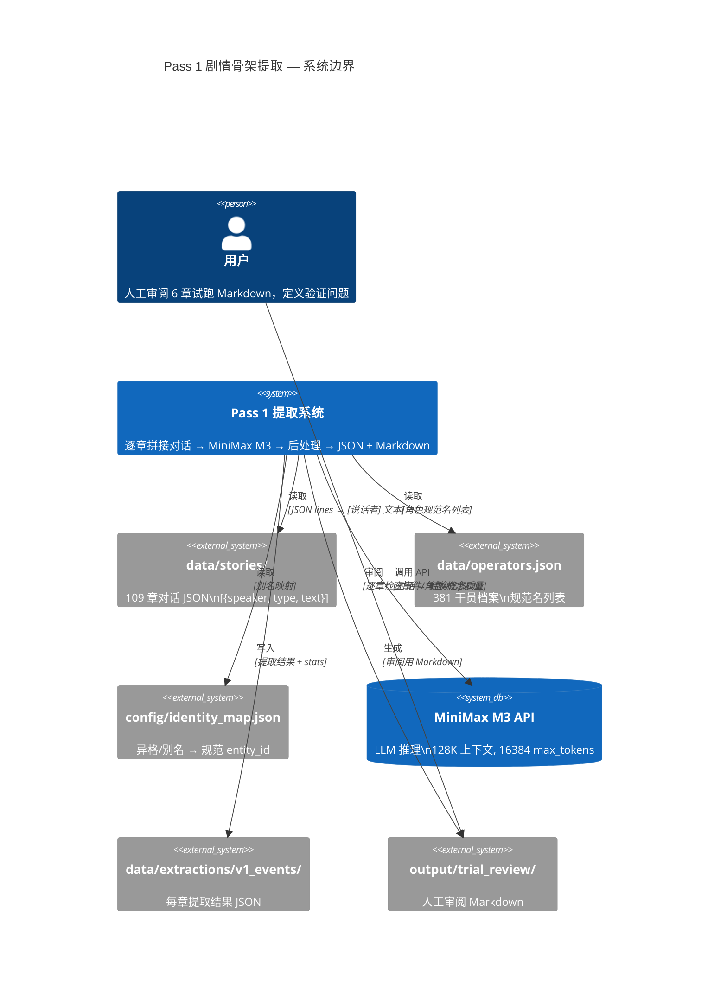
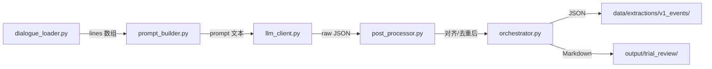

# Pass 1 — C4 Context 图

```mermaid
C4Context
    title Pass 1 剧情骨架提取 — 系统边界

    Person(user, "用户", "人工审阅 6 章试跑 Markdown，定义验证问题")

    System(pass1, "Pass 1 提取系统", "逐章拼接对话 → MiniMax M3 → 后处理 → JSON + Markdown")

    System_Ext(stories, "data/stories/", "109 章对话 JSON\n[{speaker, type, text}]")
    System_Ext(operators, "data/operators.json", "381 干员档案\n规范名列表")
    System_Ext(identity_map, "config/identity_map.json", "异格/别名 → 规范 entity_id")

    SystemDb(minimax, "MiniMax M3 API", "LLM 推理\n128K 上下文, 16384 max_tokens")

    System_Ext(output, "data/extractions/v1_events/", "每章提取结果 JSON")
    System_Ext(review, "output/trial_review/", "人工审阅 Markdown")

    Rel(user, review, "审阅", "逐章检查事件/角色/概念质量")
    Rel(pass1, stories, "读取", "JSON lines → [说话者] 文本")
    Rel(pass1, operators, "读取", "角色规范名列表")
    Rel(pass1, identity_map, "读取", "别名映射")
    Rel(pass1, minimax, "调用 API", "对话 → 结构化 JSON")
    Rel(pass1, output, "写入", "提取结果 + stats")
    Rel(pass1, review, "生成", "审阅用 Markdown")
```

## 模块内部数据流

```mermaid
flowchart LR
    A[dialogue_loader.py] -->|lines 数组| B[prompt_builder.py]
    B -->|prompt 文本| C[llm_client.py]
    C -->|raw JSON| D[post_processor.py]
    D -->|对齐/去重后| E[orchestrator.py]
    E -->|JSON| F[data/extractions/v1_events/]
    E -->|Markdown| G[output/trial_review/]
```
