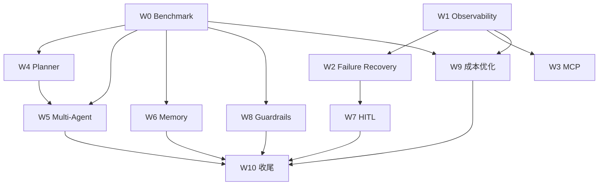

# 升级路线图 — 窗口任务制（2026-08-15）

> 依据：《01_现有明日方舟LLM_Wiki项目评估与升级方案.md》（下称「升级方案」）
> 规则：CLAUDE.md 第五章 U-01~U-14、第六章升级工作流
> 执行模式：**每个会话窗口只处理一个任务**，任务完成（含 Review + devlog 记录）后关闭窗口，再开新窗口领下一个任务。

---

## 一、总目标

从「问答 Agent」升级为 **领域自治研究 Agent**，证明可评测、可观测、可控、可恢复的生产级 Agent 系统能力。

```text
User → Intent/Router → Planner → (Knowledge/Research/Timeline Agent) → MCP
     → Evidence Aggregator → Critic → Fact Checker → Human Approval → Final Answer
     → Memory / Evaluation / Observability（PostgreSQL+Vector / Dataset / Langfuse+OTel）
```

**优先级总览**（升级方案 §16）：P0 = Evaluation · Observability · MCP · Planner · Failure Recovery；P1 = Multi-Agent · Memory · HITL · Guardrails · 成本优化；P2 = Browser Agent · Long-running · Self-improvement · KG reasoning。

---

## 二、任务窗口清单

| 窗口 | 任务 | 优先级 | 前置依赖 | 状态 |
|------|------|--------|----------|------|
| W0 | Evaluation Benchmark 建库 | P0 | 无 | ✅ 完成（100 题生成 ✅ · DeepEval 落地 ✅ · 路由修复 ✅ · mimo 统一 judge 基线 ✅ · 打分层 bug 修复+测试补全 ✅；基线 report_v1_mimo.md overall 0.857，事件类最弱待 W4/W5） |
| W1 | Observability / Tracing（Langfuse + OTel） | P0 | 无（可与 W0 并行） | ✅ 完成（本地 Docker 部署 Langfuse v4 ✅ · observability 包+可开关 traced ✅ · 全链路埋点 ✅ · 真实问答 trace 树验证 ✅ · 成本汇总脚本 ✅） |
| W2 | Failure Recovery 恢复链 | P0 | W1（可观测才能度量恢复效果） | ✅ 完成（2026-08-18：resilience 模块（timeout/retry/breaker/fallback）✅ · 工具执行接入 ✅ · LLM chat_completion 重试 ✅ · LangGraph SqliteSaver checkpoint 断点续跑 ✅ · 失败埋点 retries/breaker/fallback 入 trace ✅；验收 15/15 PASS，10 题回归无回落） |
| W3 | MCP Server 包装知识库 | P0 | W1（trace 覆盖 MCP 调用） | ✅ 完成（2026-08-18：MCPServer 5 工具（search_entities/search_events/query_relationship/query_timeline/search_story）✅ · client 同步封装+resilience ✅ · Agent 双轨切换（ARKNIGHTS_USE_MCP=1，失败回退内部函数）✅ · trace tool_call→mcp_call 层级 ✅；真实问答 14-19 工具调用 ✅；10 题 A/B MCP 0.967 vs 内部 0.936 不降反升 ✅） |
| W4 | Planner 显式任务规划 | P0 | W0（先有评测标尺） | ✅ 完成（2026-08-18/19：planner.py 任务图（LLM 规划+规则兜底+校验）✅ · Plan→Execute→Synthesize 图 ✅ · 双轨 ARKNIGHTS_AGENT_MODE ✅ · 同环境 10 题 A/B Planner 0.915 vs ReAct 0.895 ✅ · 任务级 ReAct 混合（ARKNIGHTS_PLANNER_TASK_REACT）+ 崩溃兜底（ARKNIGHTS_PLANNER_FALLBACK）✅ · 自测 5 问对比报告 output/eval/w4_user_test_report.md ✅） |
| W5 | Multi-Agent 架构 | P1 | W4（Planner 是 Manager 的前置） | ❌ 用户决策跳过（2026-08-18） |
| W6 | Memory 三层记忆 | P1 | W0（评测复用收益） | ❌ 用户决策跳过（2026-08-18） |
| W7 | Human-in-the-loop | P1 | W2（人工升级是恢复链末端） | ❌ 用户决策跳过（2026-08-18） |
| W8 | Guardrails / Security | P1 | W0 | ❌ 用户决策跳过（2026-08-18） |
| W9 | Cost / Latency 优化 | P1 | W1（数据采集）+ W0（效果对比） | ❌ 用户决策跳过（2026-08-18） |
| W10 | 收尾：简历定位 + 文档 + 演示 | — | W2–W4 完成（P1 已跳过） | ⏳ |

**依赖关系图**：



---

## 三、任务详情

### W0 — Evaluation Benchmark 建库（P0 · 首窗口）

- **升级方案章节**：§7（最重要）+ §2 能力表 Evaluation 🔴
- **目标**：建立固定 Benchmark 与评测脚手架，产出 Agent V1 基线指标
- **交付物**：
  - `benchmarks/arknights_bench/`：100–500 条高质量问题集（JSONL），八类覆盖——单跳事实 / 多跳关系 / 时间线 / 人物关系 / 跨章节 / 多工具 / 无答案 / 易幻觉
  - 每条含：question、answer_key（参考答案 + 证据出处）、category、difficulty、requires_tools
  - `arknights_wiki/eval/`：评测运行器（批量问答 → 指标计算 → 报告）
  - 指标：Answer Correctness / Faithfulness / Context Precision / Context Recall / Citation Accuracy / Tool Selection Accuracy / Hallucination Rate / Task Completion Rate
  - 报告输出 `output/eval/report_v1.md`（含逐题明细 + 汇总表）
- **验收标准**：benchmark 可一键运行；每类问题 ≥10 条；指标有明确定义与实现；报告含 Agent V1 基线
- **备注**：问题集需人工审核质量（N-01 多与人交互——邀请用户抽验题目）；无答案/易幻觉类必须人工构造而非 LLM 生成

### W1 — Observability / Tracing（P0）

- **升级方案章节**：§8
- **目标**：每次 Agent 执行产出完整 Trace，逐步可观测
- **交付物**：
  - Langfuse（本地部署或云）+ OpenTelemetry SDK 接入
  - Trace 覆盖：User Request → Planner → Agent Handoff → Retrieval → Tool Call → LLM Call → Retry → Critic → Final Answer
  - 每步记录：latency / input+output tokens / model / tool / error / retry / cost
  - 指标埋点与 `output/devlog.md` 成本汇总对接（1.4 节监控表）
- **验收标准**：任意一次问答可导出完整 trace 树；指标字段齐全；不侵入业务逻辑（可开关）
- **备注**：需用户确认 Langfuse 部署方式（本地 docker / 云端 / 仅本地文件导出）

### W2 — Failure Recovery 恢复链（P0）

- **升级方案章节**：§12
- **目标**：工具调用从「失败即错」升级为完整恢复链
- **交付物**：
  - 工具调用包装：timeout → retry（指数退避）→ circuit breaker → fallback tool → checkpoint/resume → human escalation
  - LangGraph checkpoint 持久化（断点续跑）
  - 幂等性与部分失败处理策略
- **验收标准**：模拟工具失败场景（超时/报错/连续失败）均可按恢复链正确降级；恢复过程在 trace 中可见（W1）
- **依赖**：W1

### W3 — MCP Server 包装知识库（P0）

- **升级方案章节**：§6
- **目标**：知识库能力标准协议化，Agent 通过 MCP 访问而非直接内部函数
- **交付物**：
  - MCP Server（Python，`arknights_wiki/mcp_server/`）：search_entities / search_events / query_relationship / query_timeline / search_story
  - 复用现有检索层（agent/retrieval.py、store/）为只读后端
  - Agent 侧工具改为 MCP client 调用（可先双轨：内部函数 + MCP，评测对比后切换）
  - 工具 schema（输入/输出）完整定义
- **验收标准**：MCP server 独立可启动；Agent 通过 MCP 完成一次真实问答；W0 评测通过 MCP 路径不回归
- **备注**：README 数据层 SQLite/FAISS 均可作为 MCP 后端；权限只读（配合 W8 权限分级）

### W4 — Planner 显式任务规划（P0）

- **升级方案章节**：§4
- **目标**：复杂问题显式拆解为任务图并行/串行执行
- **交付物**：
  - Planner 节点：问题 → 任务图（任务列表 + 依赖 + 工具需求）
  - 任务执行器：并行/串行调度 + 结果聚合
  - 示例场景：「分析凯尔希与罗德岛的历史关系并整理时间线」拆解为 6 步（§4 例）
- **验收标准**：W0 多跳/时间线/多工具类问题通过 Planner 路径指标 ≥ 当前 ReAct 基线；任务图在 trace 可见
- **依赖**：W0

### W5 — Multi-Agent 架构（P1）

- **升级方案章节**：§5 + §14 架构图
- **目标**：Research Manager 编排 KG / Timeline / Character 子 Agent + Critic + Final Writer
- **交付物**：
  - 角色划分与 routing / handoff 协议
  - 并行执行与状态共享（LangGraph state + checkpoint）
  - Critic 校验环节 + Final Writer 汇总
- **验收标准**：W0 全类别指标对比单 Agent 有提升或有明确取舍记录；演示一次「对比 / 时间线 / 人物关系」复合问题完整走多 Agent 流程
- **依赖**：W4

### W6 — Memory 三层记忆（P1）

- **升级方案章节**：§9
- **目标**：短期（任务状态）/ 长期（用户偏好、常问主题）/ 情景（历史任务复用）记忆
- **交付物**：
  - 存储：SQLite（可升级 PostgreSQL）；用户隔离
  - 情景记忆：历史研究任务结果缓存，相似问题复用减少重复检索
- **验收标准**：会话间长期记忆生效（重启后保留）；情景记忆命中可度量（缓存命中率）；多用户数据隔离（配合 W8）
- **依赖**：W0

### W7 — Human-in-the-loop（P1）

- **升级方案章节**：§10
- **目标**：高风险操作人工确认
- **交付物**：
  - 风险分级：高风险工具（写/删/发布/外部 API 写）执行前中断并请求确认
  - API 层：确认/拒绝/修改 三态；超时默认拒绝
  - 演示场景：「生成人物关系报告并发布」→ 人工审核 → 发布
- **验收标准**：高风险操作未经确认不执行；确认流程在 trace 可见；超时安全策略
- **依赖**：W2

### W8 — Guardrails / Security（P1）

- **升级方案章节**：§11
- **目标**：注入防护、权限分级、数据隔离、输出校验
- **交付物**：
  - 工具权限分级 READ / WRITE / DELETE / ADMIN（与 W3 MCP 权限映射）
  - Prompt injection 防护：外部内容标记不可信 + 校验（参考已有注入防护经验，git log 29d4f83）
  - LLM 输出 Pydantic / JSON Schema 校验层
  - 用户数据隔离测试
- **验收标准**：注入攻击样例全部被拦截；越权调用被拒；非法输出 schema 被拒并重试
- **依赖**：W0

### W9 — Cost / Latency 优化（P1）

- **升级方案章节**：§13
- **目标**：量化成本与延迟并优化
- **交付物**：
  - 每请求指标采集：P50/P95 latency、tokens/request、cost/request、tool calls/request、retry rate、success rate
  - 优化手段（数据佐证）：prompt cache / retrieval cache / result cache / model routing（小大模型分工）/ parallel tool calls / context compression / streaming
- **验收标准**：W0 全量跑批给出成本/延迟报告；每项优化有 before/after 数据；指标不回归
- **依赖**：W0 + W1

### W10 — 收尾（—）

- **升级方案章节**：§1 定位 + §15 简历定位 + §17 最终目标
- **目标**：项目包装为「大规模领域知识图谱与自治研究 Agent」旗舰项目
- **交付物**：
  - README.md 重写（升级后架构、能力矩阵、Benchmark 演进表 V1→V2→V3）
  - docs/diagrams/ 更新最终架构图（§14 架构）
  - 演示脚本/录屏要点（展示评测、trace、多 Agent、HITL）
  - output/devlog.md 升级全程总结
- **验收标准**：README 完整反映最终系统；演示可复现
- **依赖**：W2–W4 完成（2026-08-18 用户决策：P1 W5–W9 全部跳过，收尾仅依赖 P0）

---

## 四、窗口交接协议

1. **进入窗口**（新会话）：读 README.md → output/devlog.md → 本路线图对应任务 → 该任务已产出 spec/plan
2. **窗口内**：按 CLAUDE.md 第六章升级工作流执行（Spec → Plan → 评测基线 → 实施 → 验证 → Review → commit）
3. **退出窗口**：更新本路线图任务状态（⏳→✅，未完成 ❌ 附原因）；更新 output/devlog.md（指标、决策、问题）；涉及数据基线/技术栈变更时更新 README.md
4. **并行窗口**：W1 可与 W0 并行；其余按依赖表串行。并行窗口需先经用户确认（N-01）

---

## 五、范围外（P2，暂不排期）

Browser Agent / Long-running Task / Agent Self-improvement / 更复杂的 KG reasoning（升级方案 §16 P2）
